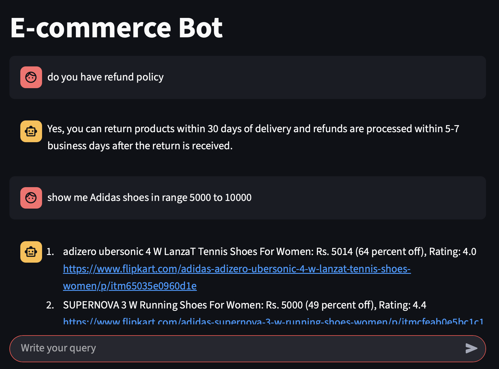

### FAQ Chatbot with ChromaDB & Groq

This project implements a FAQ chatbot using a Large Language Model (LLM) via Groq and ChromaDB as a VectorDB for efficient retrieval. Users can query FAQs, and the bot retrieves the most relevant entries from the vector database and generates answers based on the context.

### Features:
* Ingest FAQs from a CSV file into ChromaDB (VectorDB)
* Retrieve top relevant FAQs for a user query using vector embeddings
* Generate answers using Groq LLM with context from the VectorDB
* Ensures responses are based only on available data (I don't know if no answer exists)

### Future Enhancements:

* Automatically update ChromaDB collection if the CSV changes.
* Add a web interface (Streamlit or Flask) for interactive FAQ queries.
* Support multi-language FAQs.
* Experiment with other LLMs or embedding models for improved results.

### Set up .env file:

 * Groq_API_KEY=gsk_your_api_key_here
 *  Groq_MODEL=llama-3.3-70b-instruct

### Install dependencies:

pip install -r requirements.txt
